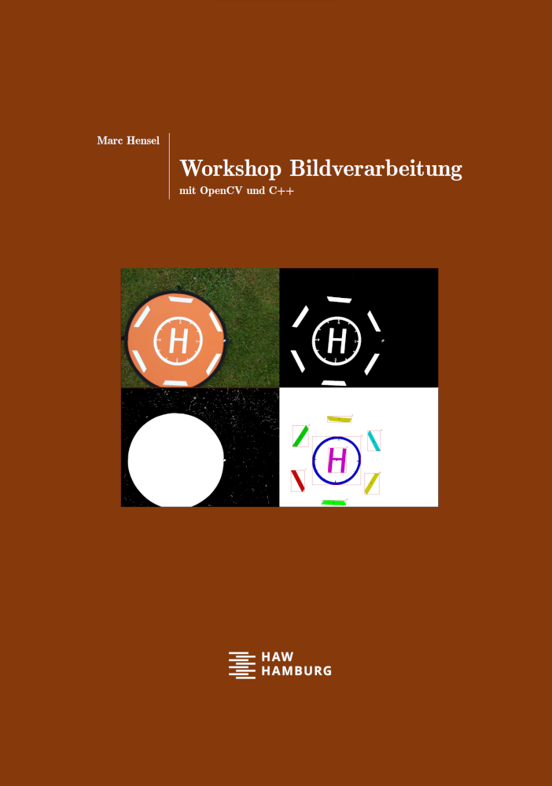

# Image processing with OpenCV and C++

I have been in love with image processing for many, many years :heart: - as student, working on my PhD on medical X-ray imaging, as professional image processing engineer in industry, back at university teaching at Hamburg University of Applied Sciences (HAW Hamburg), and playing around privately "just for fun".

Meanwhile, I am creating an imaging course for my students containing lots of sample code, many interactive slide sets, and material being rather a book than a script. This raises the question, why not share material with ... well, _you_, for instance, in case you find it helpful for your students or yourself. So this is exactly what I intend to do.

I will rework the material over the winter term 2023/24 and upload it as soon as it is suited for publishing. Please be patient.
 

## Upload status (uploaded or still to come)
- [ ] [Sample codes](src/lecture) used in the lecture
- [ ] Sample solutions for the exercises
- [ ] Imaging book
- [ ] Lecture slides

## Contact
Marc Hensel, University of Applied Sciences Hamburg (HAW Hamburg)

http://www.haw-hamburg.de/marc-hensel
